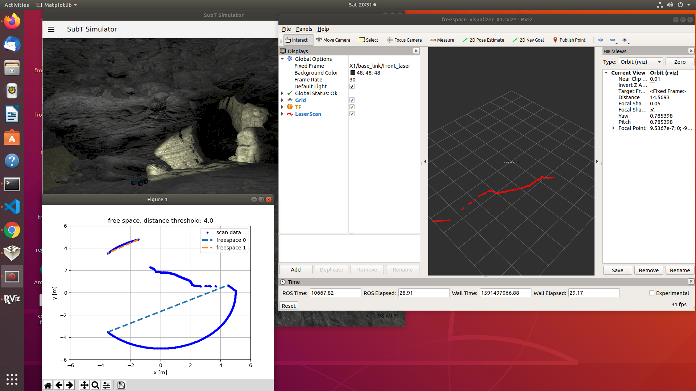

# ros package dwsubt

Currently supports 

1. left wall following for the X1 robot, sensor configuration 1. Only works for the tunnel circuit practice.

2. Freespace visualization of laser xy data points.


## Build Instructions
Clone the repository in the src directory of a catkin workspace.

```
cd ~/catkin_ws/src
git clone https://github.com/willydlw/dwsubt.git
cd ~/catkin_ws
catkin_make 
```

## Wall Following via steering towards largest freespace opening

Base controller node implements a simple state machine that moves robot to entrance and then begins driving toward the largest freespace opening detected in laser data scan. This
"works" for the X1 and X2 robots in the tunnel circuit practice worlds.

The laser_obstacle_avoid node generates a steering command, based on the largest freespace opening. The steering angle varies, while the linear x velocity remains constant. The command velocity topic is only published at 1 Hz which allows time for the robot to travel in the x direction. Lowering this frequency will cause the robot to generally turn in circles, as there is no other form of control. This is a very simplistic model, which only serves as a simple behavioral example.

### Next Steps

This code is in development to create a working wall-following solution for ground vehicle robots in the cave circuit. 

1. Implement drive-forward behavior, centering in-between obstacles, and turning only when an obstacle prevents the robot from driving forward.
2. Implement find-wall and follow-wall behaviors.

### Running the example

#### Terminal 1

```
source ~/subt_ws/install/setup.bash
ign launch -v 4 tunnel_circuit_practice.ign worldName:=tunnel_circuit_practice_01 robotName1:=X1 robotConfig1:=X1_SENSOR_CONFIG_1

```

#### Terminal 2

In the catkin workspace directory

```
source ./devel/setup.bash
roslaunch dwsubt laser_obstacle_avoid.launch
```


#### Terminal 3
```
source ./devel/setup.bash
roslaunch dwsubt freespace_visualizer.launch
```


## Freespace Visualizer 

The free_space_visualizer node plots the detected free space openings. Want a verification tool that allows us to see the openings are correctly detected and show which opening is selected as a goal point.

The current state plots the laser scan in its xy coordinate form. The free space endpoints are connected by dashed lines.


### Running the freespace visualizer while using joystick teleop

Current testing uses the simple_cave_01 or tunnel_circuit_practice_01 and the X1_SENSOR_CONFIG_1. The laser scan parameters are defined in laser_planar5m_params.yaml

### Terminal 1

```
source ~/subt_ws/install/setup.bash
ign launch -v 4 cave_circuit.ign worldName:=simple_cave_01 robotName1:=X1 robotConfig1:=X1_SENSOR_CONFIG_1
```

### Terminal 2

```
source ~/subt_ws/install/setup.bash
roslaunch subt_example teleop.launch
```


### Terminal 3

```
source ./devel/setup.bash
roslaunch dwsubt freespace_visualizer.launch
```


The image below shows the expected output.





